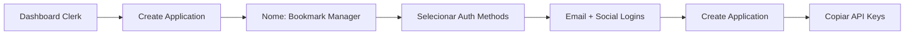

# Configuração do Clerk e Autenticação OAuth

## 🔐 Visão Geral do Clerk

O Clerk é uma solução completa de autenticação e gerenciamento de usuários que oferece:

- ✅ Autenticação pronta para uso (Email, Google, GitHub, etc.)
- ✅ Componentes React pré-construídos
- ✅ Gerenciamento de sessões
- ✅ OAuth 2.1 com PKCE integrado
- ✅ Dynamic Client Registration para MCP
- ✅ Webhooks e eventos
- ✅ Dashboard administrativo

## 📋 Passo a Passo da Configuração

### 1. Criando uma Conta no Clerk

1. Acesse [clerk.com](https://clerk.com)
2. Clique em "Get started free"
3. Crie sua conta usando email ou GitHub
4. Você será redirecionado ao dashboard

### 2. Criando uma Aplicação



#### Passos detalhados:

1. **No Dashboard**, clique em "+ New application"

2. **Configure a aplicação**:

   - **Application name**: Bookmark Manager
   - **Select authentication methods**:
     - ✅ Email address
     - ✅ Google (opcional)
     - ✅ GitHub (opcional)
     - ✅ Discord (opcional)

3. **Clique em "Create application"**

4. **Copie as chaves** que aparecem:
   ```
   Publishable key: pk_test_...
   Secret key: sk_test_...
   ```

### 3. Configurando as Variáveis de Ambiente

Crie/edite o arquivo `.env`:

```bash
# Clerk - SUBSTITUA com suas chaves reais
NEXT_PUBLIC_CLERK_PUBLISHABLE_KEY=pk_test_Y2xlYXJpbmctYm9iY2F0LTk5LmNsZXJrLmFjY291bnRzLmRldiQ
CLERK_SECRET_KEY=sk_test_abcdefghijklmnopqrstuvwxyz1234567890

# URLs do Clerk (opcionais - use os defaults se não especificar)
NEXT_PUBLIC_CLERK_SIGN_IN_URL=/sign-in
NEXT_PUBLIC_CLERK_SIGN_UP_URL=/sign-up
NEXT_PUBLIC_CLERK_AFTER_SIGN_IN_URL=/
NEXT_PUBLIC_CLERK_AFTER_SIGN_UP_URL=/

# URL da aplicação
NEXT_PUBLIC_APP_URL=http://localhost:3000
```

### 4. Habilitando Dynamic Client Registration

Este é um passo **CRUCIAL** para o MCP funcionar:

1. **No Dashboard do Clerk**, vá para sua aplicação
2. Navegue para **Configure** → **OAuth Applications**
3. Marque a opção **"Dynamic client registration"**
4. Clique em **"Save"**


> ⚠️ **Importante**: Sem esta configuração, clientes MCP não conseguirão se autenticar!

### 5. Configurando o Middleware

Crie `src/middleware.ts`:

```typescript
import { clerkMiddleware, createRouteMatcher } from "@clerk/nextjs/server";
import { NextResponse } from "next/server";

// Define rotas públicas (não precisam autenticação)
const isPublicRoute = createRouteMatcher([
  "/", // Home page pode ser pública
  "/sign-in(.*)", // Páginas de login
  "/sign-up(.*)", // Páginas de cadastro
  "/.well-known/(.*)", // Endpoints OAuth (IMPORTANTE!)
  "/api/public/(.*)", // APIs públicas (se houver)
]);

// Define rotas que precisam de autenticação
const isProtectedRoute = createRouteMatcher([
  "/dashboard(.*)",
  "/api/bookmarks(.*)",
  "/settings(.*)",
]);

export default clerkMiddleware(async (auth, request) => {
  const { userId, sessionId } = await auth();

  // Log para debug (remover em produção)
  console.log("Middleware:", {
    path: request.nextUrl.pathname,
    userId,
    isPublic: isPublicRoute(request),
    isProtected: isProtectedRoute(request),
  });

  // Se é rota protegida e não está autenticado
  if (isProtectedRoute(request) && !userId) {
    // Redireciona para login
    const signInUrl = new URL("/sign-in", request.url);
    signInUrl.searchParams.set("redirect_url", request.url);
    return NextResponse.redirect(signInUrl);
  }

  // Se está autenticado e tenta acessar sign-in/sign-up
  if (
    userId &&
    (request.nextUrl.pathname.startsWith("/sign-in") ||
      request.nextUrl.pathname.startsWith("/sign-up"))
  ) {
    return NextResponse.redirect(new URL("/", request.url));
  }

  return NextResponse.next();
});

export const config = {
  matcher: [
    // Pula arquivos estáticos e internos do Next.js
    "/((?!.*\\..*|_next).*)",
    // Sempre roda para rotas de API
    "/(api|trpc)(.*)",
  ],
};
```

### 6. Configurando Provedores OAuth (Opcional)

Para adicionar login social (Google, GitHub, etc.):

#### Google OAuth:

1. Acesse [console.cloud.google.com](https://console.cloud.google.com)
2. Crie um novo projeto ou selecione existente
3. Ative a API do Google+
4. Crie credenciais OAuth 2.0:
   - **Authorized redirect URIs**:
     ```
     https://your-clerk-domain.clerk.accounts.dev/v1/oauth_callback
     ```
5. Copie Client ID e Client Secret
6. No Clerk Dashboard:
   - Configure → Social Connections → Google
   - Cole as credenciais

#### GitHub OAuth:

1. Acesse [github.com/settings/developers](https://github.com/settings/developers)
2. New OAuth App
3. Configure:
   - **Application name**: Bookmark Manager
   - **Homepage URL**: http://localhost:3000
   - **Authorization callback URL**:
     ```
     https://your-clerk-domain.clerk.accounts.dev/v1/oauth_callback
     ```
4. Copie Client ID e Client Secret
5. Configure no Clerk Dashboard

### 7. Componentes de Autenticação

#### Layout com ClerkProvider

`src/app/layout.tsx`:

```typescript
import type { Metadata } from "next";
import { ClerkProvider } from "@clerk/nextjs";
import { ptBR } from "@clerk/localizations";
import "./globals.css";

export const metadata: Metadata = {
  title: "Bookmark Manager",
  description: "Gerencie seus bookmarks com integração MCP",
};

export default function RootLayout({
  children,
}: {
  children: React.ReactNode;
}) {
  return (
    <ClerkProvider
      localization={ptBR} // Localização em português
      appearance={{
        // Customização visual (opcional)
        baseTheme: undefined, // ou 'dark'
        variables: {
          colorPrimary: "#0070f3",
          colorBackground: "#ffffff",
          colorText: "#000000",
          colorTextSecondary: "#666666",
          colorDanger: "#ee0000",
          borderRadius: "0.5rem",
        },
        elements: {
          formButtonPrimary: "bg-blue-600 hover:bg-blue-700",
          card: "shadow-lg",
        },
      }}
    >
      <html lang="pt-BR">
        <body>{children}</body>
      </html>
    </ClerkProvider>
  );
}
```

#### Header com Autenticação

`src/components/Header.tsx`:

```typescript
"use client";

import {
  SignInButton,
  SignUpButton,
  SignedIn,
  SignedOut,
  UserButton,
  useUser,
} from "@clerk/nextjs";

export function Header() {
  const { user } = useUser();

  return (
    <header className="header">
      <div className="header-content">
        <h1>Bookmark Manager</h1>

        <nav className="header-nav">
          <SignedOut>
            <SignInButton mode="modal">
              <button className="btn btn-primary">Entrar</button>
            </SignInButton>

            <SignUpButton mode="modal">
              <button className="btn btn-secondary">Cadastrar</button>
            </SignUpButton>
          </SignedOut>

          <SignedIn>
            <span className="user-greeting">
              Olá, {user?.firstName || "Usuário"}!
            </span>

            <UserButton
              afterSignOutUrl="/"
              appearance={{
                elements: {
                  avatarBox: "w-10 h-10",
                },
              }}
            />
          </SignedIn>
        </nav>
      </div>
    </header>
  );
}
```

### 8. Protegendo Rotas de API

`src/app/api/bookmarks/route.ts`:

```typescript
import { auth } from "@clerk/nextjs/server";
import { NextResponse } from "next/server";

export async function GET() {
  // Obtém informações de autenticação
  const { userId, sessionClaims } = await auth();

  // Verifica se está autenticado
  if (!userId) {
    return new NextResponse("Unauthorized", { status: 401 });
  }

  // userId está disponível e verificado
  console.log("User ID:", userId);
  console.log("Session Claims:", sessionClaims);

  // Continua com a lógica...
  return NextResponse.json({
    message: "Autenticado!",
    userId,
  });
}
```

### 9. Hooks e Utilitários

#### Hook de Autenticação Customizado

`src/hooks/useAuth.ts`:

```typescript
"use client";

import { useAuth as useClerkAuth, useUser } from "@clerk/nextjs";
import { useRouter } from "next/navigation";

export function useAuth() {
  const { isLoaded, userId, sessionId, getToken } = useClerkAuth();
  const { user, isLoaded: userLoaded } = useUser();
  const router = useRouter();

  const signOut = async () => {
    await useClerkAuth().signOut();
    router.push("/");
  };

  const getAuthToken = async () => {
    try {
      return await getToken();
    } catch (error) {
      console.error("Erro ao obter token:", error);
      return null;
    }
  };

  return {
    isLoaded: isLoaded && userLoaded,
    isSignedIn: !!userId,
    userId,
    sessionId,
    user,
    signOut,
    getAuthToken,
  };
}
```

### 10. Páginas de Autenticação Customizadas (Opcional)

#### Sign In Page

`src/app/sign-in/[[...sign-in]]/page.tsx`:

```typescript
import { SignIn } from "@clerk/nextjs";

export default function SignInPage() {
  return (
    <div className="auth-container">
      <SignIn
        appearance={{
          baseTheme: undefined,
          elements: {
            rootBox: "mx-auto",
            card: "shadow-xl",
          },
        }}
        redirectUrl="/"
        signUpUrl="/sign-up"
      />
    </div>
  );
}
```

#### Sign Up Page

`src/app/sign-up/[[...sign-up]]/page.tsx`:

```typescript
import { SignUp } from "@clerk/nextjs";

export default function SignUpPage() {
  return (
    <div className="auth-container">
      <SignUp
        appearance={{
          baseTheme: undefined,
          elements: {
            rootBox: "mx-auto",
            card: "shadow-xl",
          },
        }}
        redirectUrl="/"
        signInUrl="/sign-in"
      />
    </div>
  );
}
```

## 🔧 Configurações Avançadas

### Webhooks do Clerk

Para sincronizar dados de usuários:

1. No Dashboard: Configure → Webhooks
2. Add Endpoint: `https://your-domain.com/api/webhooks/clerk`
3. Selecione eventos:
   - `user.created`
   - `user.updated`
   - `user.deleted`

`src/app/api/webhooks/clerk/route.ts`:

```typescript
import { Webhook } from "svix";
import { headers } from "next/headers";
import { WebhookEvent } from "@clerk/nextjs/server";

export async function POST(req: Request) {
  const WEBHOOK_SECRET = process.env.CLERK_WEBHOOK_SECRET;

  if (!WEBHOOK_SECRET) {
    throw new Error("Missing CLERK_WEBHOOK_SECRET");
  }

  // Obtém headers
  const headerPayload = await headers();
  const svix_id = headerPayload.get("svix-id");
  const svix_timestamp = headerPayload.get("svix-timestamp");
  const svix_signature = headerPayload.get("svix-signature");

  if (!svix_id || !svix_timestamp || !svix_signature) {
    return new Response("Missing svix headers", { status: 400 });
  }

  // Obtém body
  const payload = await req.json();
  const body = JSON.stringify(payload);

  // Verifica webhook
  const wh = new Webhook(WEBHOOK_SECRET);
  let evt: WebhookEvent;

  try {
    evt = wh.verify(body, {
      "svix-id": svix_id,
      "svix-timestamp": svix_timestamp,
      "svix-signature": svix_signature,
    }) as WebhookEvent;
  } catch (err) {
    return new Response("Invalid signature", { status: 400 });
  }

  // Processa eventos
  switch (evt.type) {
    case "user.created":
      console.log("Novo usuário:", evt.data);
      // Criar registro no banco de dados
      break;
    case "user.updated":
      console.log("Usuário atualizado:", evt.data);
      // Atualizar dados
      break;
    case "user.deleted":
      console.log("Usuário deletado:", evt.data);
      // Limpar dados
      break;
  }

  return new Response("OK", { status: 200 });
}
```

### Customização de Emails

No Dashboard do Clerk:

1. Configure → Emails
2. Customize templates
3. Adicione sua marca

### Configuração de Sessão

No Dashboard:

1. Configure → Sessions
2. Ajuste timeout
3. Configure refresh tokens

## 🎨 Estilos para Componentes de Auth

`src/styles/auth.css`:

```css
.auth-container {
  min-height: 100vh;
  display: flex;
  align-items: center;
  justify-content: center;
  background: linear-gradient(to bottom, #f3f4f6, #e5e7eb);
}

.header {
  background: white;
  border-bottom: 1px solid #e5e7eb;
  padding: 1rem 0;
}

.header-content {
  max-width: 1200px;
  margin: 0 auto;
  padding: 0 1rem;
  display: flex;
  justify-content: space-between;
  align-items: center;
}

.header-nav {
  display: flex;
  gap: 1rem;
  align-items: center;
}

.user-greeting {
  color: #6b7280;
  font-size: 0.875rem;
  margin-right: 1rem;
}

/* Customização do UserButton */
.cl-userButtonBox {
  height: 40px;
  width: 40px;
}

.cl-userButtonTrigger {
  border: 2px solid #e5e7eb;
  transition: border-color 0.2s;
}

.cl-userButtonTrigger:hover {
  border-color: #0070f3;
}
```

## 🚨 Troubleshooting Comum

### Erro: "Unauthorized" em rotas protegidas

**Solução**: Verifique se:

1. As chaves do Clerk estão corretas no `.env`
2. O middleware está configurado corretamente
3. A rota não está na lista de rotas públicas

### Erro: "Dynamic client registration is not enabled"

**Solução**:

1. Vá ao Dashboard do Clerk
2. Configure → OAuth Applications
3. Habilite "Dynamic client registration"

### OAuth callbacks não funcionam

**Solução**: Verifique:

1. URLs de callback estão corretas nos provedores
2. Domínio do Clerk está correto
3. HTTPS em produção

---

Com estas configurações, você terá um sistema de autenticação robusto e pronto para integração com o servidor MCP!
