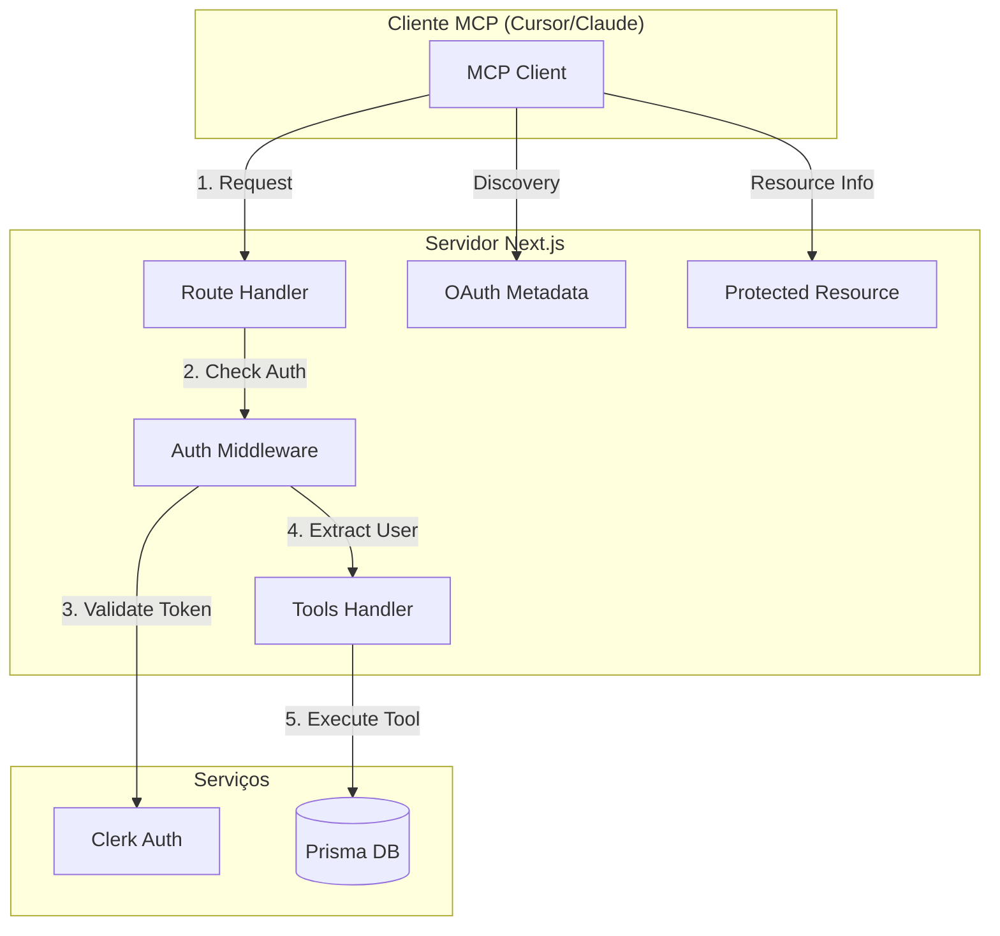
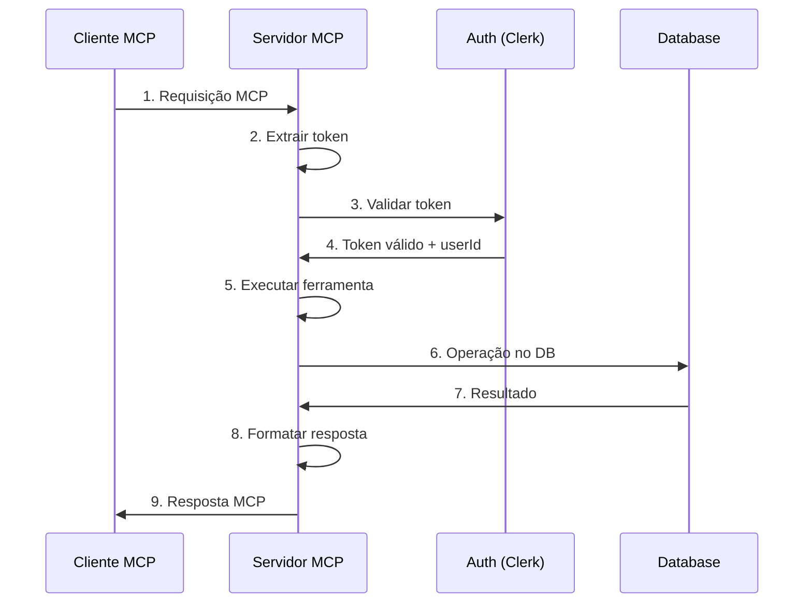

# Servidor MCP e Ferramentas

## 🤖 Visão Geral do Servidor MCP

O Model Context Protocol (MCP) permite que aplicações exponham ferramentas, recursos e prompts para modelos de linguagem. Nosso servidor MCP:

- ✅ Expõe ferramentas para gerenciar bookmarks
- ✅ Implementa autenticação OAuth 2.1 com PKCE
- ✅ Integra-se perfeitamente com o Clerk
- ✅ Suporta múltiplos clientes simultaneamente
- ✅ Fornece metadados de descoberta OAuth

## 📋 Arquitetura do Servidor MCP



## 🛠️ Implementação do Servidor MCP

### Rota Principal do MCP

`src/app/api/[transport]/route.ts`:

```typescript
import { verifyClerkToken } from "@clerk/mcp-tools/next";
import {
  createMcpHandler,
  experimental_withMcpAuth as withMcpAuth,
} from "@vercel/mcp-adapter";
import { auth, clerkClient } from "@clerk/nextjs/server";
import { z } from "zod";
import {
  getUserBookmarks,
  createUserBookmark,
  deleteUserBookmark,
  searchBookmarks,
} from "@/lib/bookmark-utils";
import { extractURLMetadata } from "@/lib/metadata-extractor";

// Inicializa cliente Clerk
const clerk = await clerkClient();

/**
 * Configuração principal do servidor MCP
 * Define todas as ferramentas disponíveis
 */
const handler = createMcpHandler(server => {
  // Metadados do servidor
  server.setServerInfo({
    name: "Bookmark Manager MCP",
    version: "1.0.0",
    description: "Gerencie seus bookmarks através de ferramentas MCP",
    capabilities: {
      tools: true,
      resources: false, // Poderia expor bookmarks como recursos
      prompts: false, // Poderia ter prompts pré-definidos
    },
  });

  // ===================================
  // FERRAMENTA: Listar Bookmarks
  // ===================================
  server.tool(
    "get_user_bookmarks",
    "Obtém todos os bookmarks do usuário autenticado com opções de filtro e paginação",
    {
      // Parâmetros opcionais com validação Zod
      search: z
        .string()
        .optional()
        .describe("Termo de busca para filtrar bookmarks"),

      limit: z
        .number()
        .int()
        .min(1)
        .max(100)
        .default(20)
        .optional()
        .describe("Número máximo de bookmarks a retornar"),

      page: z
        .number()
        .int()
        .positive()
        .default(1)
        .optional()
        .describe("Página de resultados"),

      tags: z
        .array(z.string())
        .optional()
        .describe("Filtrar por tags específicas"),

      sort: z
        .enum(["createdAt", "updatedAt", "title"])
        .default("createdAt")
        .optional()
        .describe("Campo para ordenação"),

      order: z
        .enum(["asc", "desc"])
        .default("desc")
        .optional()
        .describe("Direção da ordenação"),
    },
    async (args, { authInfo }) => {
      try {
        // Extrai userId da autenticação
        const userId = authInfo!.extra!.userId! as string;

        // Log para debug
        console.log("[MCP] get_user_bookmarks called by:", userId);

        // Busca bookmarks com filtros
        const result = await getUserBookmarks(userId, {
          search: args.search,
          pagination: {
            page: args.page || 1,
            limit: args.limit || 20,
          },
          tags: args.tags,
          orderBy: {
            [args.sort || "createdAt"]: args.order || "desc",
          },
        });

        // Formata resposta
        const response = {
          bookmarks: result.items,
          pagination: {
            page: result.pagination.page,
            limit: result.pagination.limit,
            total: result.pagination.total,
            totalPages: result.pagination.totalPages,
          },
          summary: `Encontrados ${result.items.length} bookmarks de ${result.pagination.total} total`,
        };

        return {
          content: [
            {
              type: "text",
              text: JSON.stringify(response, null, 2),
            },
          ],
        };
      } catch (error) {
        console.error("[MCP] Error in get_user_bookmarks:", error);
        return {
          content: [
            {
              type: "text",
              text: `Erro ao buscar bookmarks: ${
                error instanceof Error ? error.message : "Erro desconhecido"
              }`,
            },
          ],
          isError: true,
        };
      }
    }
  );

  // ===================================
  // FERRAMENTA: Criar Bookmark
  // ===================================
  server.tool(
    "create_bookmark",
    "Cria um novo bookmark para o usuário autenticado",
    {
      url: z
        .string()
        .url("URL inválida")
        .describe("URL do site a ser salvo como bookmark"),

      title: z
        .string()
        .min(1, "Título é obrigatório")
        .max(200)
        .optional()
        .describe(
          "Título do bookmark (se não fornecido, será extraído da página)"
        ),

      notes: z
        .string()
        .max(1000)
        .optional()
        .describe("Notas ou descrição sobre o bookmark"),

      tags: z
        .array(z.string())
        .max(10)
        .optional()
        .describe("Tags para categorizar o bookmark"),

      extractMetadata: z
        .boolean()
        .default(true)
        .optional()
        .describe("Se deve extrair metadados da URL automaticamente"),
    },
    async (args, { authInfo }) => {
      try {
        const userId = authInfo!.extra!.userId! as string;

        console.log("[MCP] create_bookmark called:", { userId, url: args.url });

        let bookmarkData = {
          url: args.url,
          title: args.title || "",
          notes: args.notes || "",
          tags: args.tags || [],
        };

        // Extrai metadados se solicitado e título não fornecido
        if (args.extractMetadata && !args.title) {
          try {
            const metadata = await extractURLMetadata(args.url);
            if (metadata) {
              bookmarkData.title = metadata.title || bookmarkData.title;
              if (!bookmarkData.notes && metadata.description) {
                bookmarkData.notes = metadata.description;
              }
            }
          } catch (metaError) {
            console.warn("[MCP] Failed to extract metadata:", metaError);
          }
        }

        // Valida se tem título
        if (!bookmarkData.title) {
          bookmarkData.title = new URL(args.url).hostname;
        }

        // Cria o bookmark
        const newBookmark = await createUserBookmark(userId, bookmarkData);

        return {
          content: [
            {
              type: "text",
              text: `✅ Bookmark criado com sucesso!\n\n${JSON.stringify(
                newBookmark,
                null,
                2
              )}`,
            },
          ],
        };
      } catch (error) {
        console.error("[MCP] Error in create_bookmark:", error);

        // Trata erros específicos
        if (error instanceof Error) {
          if (error.message.includes("duplicate")) {
            return {
              content: [
                {
                  type: "text",
                  text: `⚠️ Esta URL já foi salva como bookmark anteriormente.`,
                },
              ],
              isError: false, // Não é erro crítico
            };
          }
        }

        return {
          content: [
            {
              type: "text",
              text: `❌ Erro ao criar bookmark: ${
                error instanceof Error ? error.message : "Erro desconhecido"
              }`,
            },
          ],
          isError: true,
        };
      }
    }
  );

  // ===================================
  // FERRAMENTA: Deletar Bookmark
  // ===================================
  server.tool(
    "delete_bookmark",
    "Deleta um bookmark específico do usuário",
    {
      id: z
        .string()
        .uuid("ID deve ser um UUID válido")
        .describe("ID do bookmark a ser deletado"),

      confirm: z
        .boolean()
        .default(true)
        .optional()
        .describe("Confirmar deleção (previne deleção acidental)"),
    },
    async (args, { authInfo }) => {
      try {
        const userId = authInfo!.extra!.userId! as string;

        if (!args.confirm) {
          return {
            content: [
              {
                type: "text",
                text: "⚠️ Deleção cancelada. Defina confirm=true para confirmar.",
              },
            ],
          };
        }

        console.log("[MCP] delete_bookmark called:", { userId, id: args.id });

        const success = await deleteUserBookmark(userId, args.id);

        if (!success) {
          return {
            content: [
              {
                type: "text",
                text: "❌ Bookmark não encontrado ou você não tem permissão para deletá-lo.",
              },
            ],
            isError: true,
          };
        }

        return {
          content: [
            {
              type: "text",
              text: "✅ Bookmark deletado com sucesso!",
            },
          ],
        };
      } catch (error) {
        console.error("[MCP] Error in delete_bookmark:", error);
        return {
          content: [
            {
              type: "text",
              text: `❌ Erro ao deletar bookmark: ${
                error instanceof Error ? error.message : "Erro desconhecido"
              }`,
            },
          ],
          isError: true,
        };
      }
    }
  );

  // ===================================
  // FERRAMENTA: Buscar Bookmarks
  // ===================================
  server.tool(
    "search_bookmarks",
    "Busca bookmarks usando pesquisa de texto completo",
    {
      query: z
        .string()
        .min(2, "Query deve ter pelo menos 2 caracteres")
        .describe("Termo de busca para procurar em título, URL e notas"),

      limit: z
        .number()
        .int()
        .min(1)
        .max(50)
        .default(10)
        .optional()
        .describe("Número máximo de resultados"),
    },
    async (args, { authInfo }) => {
      try {
        const userId = authInfo!.extra!.userId! as string;

        console.log("[MCP] search_bookmarks called:", {
          userId,
          query: args.query,
        });

        const results = await searchBookmarks(userId, args.query, args.limit);

        if (results.length === 0) {
          return {
            content: [
              {
                type: "text",
                text: `Nenhum bookmark encontrado para "${args.query}"`,
              },
            ],
          };
        }

        // Formata resultados com destaque
        const formattedResults = results
          .map((bookmark, index) => {
            return `${index + 1}. ${bookmark.title}\n   URL: ${
              bookmark.url
            }\n   ${
              bookmark.notes
                ? `Notas: ${bookmark.notes.substring(0, 100)}...`
                : ""
            }\n`;
          })
          .join("\n");

        return {
          content: [
            {
              type: "text",
              text: `Encontrados ${results.length} bookmarks:\n\n${formattedResults}`,
            },
          ],
        };
      } catch (error) {
        console.error("[MCP] Error in search_bookmarks:", error);
        return {
          content: [
            {
              type: "text",
              text: `Erro na busca: ${
                error instanceof Error ? error.message : "Erro desconhecido"
              }`,
            },
          ],
          isError: true,
        };
      }
    }
  );

  // ===================================
  // FERRAMENTA: Informações do Usuário
  // ===================================
  server.tool(
    "get_user_info",
    "Obtém informações sobre o usuário autenticado e estatísticas de uso",
    {},
    async (_, { authInfo }) => {
      try {
        const userId = authInfo!.extra!.userId! as string;

        // Busca dados do usuário no Clerk
        const userData = await clerk.users.getUser(userId);

        // Busca estatísticas
        const bookmarkCount = await prisma.bookmark.count({
          where: { userId },
        });

        const response = {
          user: {
            id: userData.id,
            email: userData.emailAddresses[0]?.emailAddress,
            firstName: userData.firstName,
            lastName: userData.lastName,
            createdAt: userData.createdAt,
          },
          stats: {
            totalBookmarks: bookmarkCount,
            accountAge: `${Math.floor(
              (Date.now() - userData.createdAt) / (1000 * 60 * 60 * 24)
            )} dias`,
          },
        };

        return {
          content: [
            {
              type: "text",
              text: JSON.stringify(response, null, 2),
            },
          ],
        };
      } catch (error) {
        console.error("[MCP] Error in get_user_info:", error);
        return {
          content: [
            {
              type: "text",
              text: `Erro ao obter informações: ${
                error instanceof Error ? error.message : "Erro desconhecido"
              }`,
            },
          ],
          isError: true,
        };
      }
    }
  );

  // ===================================
  // FERRAMENTA: Exportar Bookmarks
  // ===================================
  server.tool(
    "export_bookmarks",
    "Exporta todos os bookmarks em diferentes formatos",
    {
      format: z
        .enum(["json", "csv", "markdown", "html"])
        .default("json")
        .describe("Formato de exportação dos bookmarks"),
    },
    async (args, { authInfo }) => {
      try {
        const userId = authInfo!.extra!.userId! as string;
        const bookmarks = await getUserBookmarks(userId, {});

        let output = "";

        switch (args.format) {
          case "json":
            output = JSON.stringify(bookmarks.items, null, 2);
            break;

          case "csv":
            output = "Title,URL,Notes,Tags,Created At\n";
            output += bookmarks.items
              .map(
                b =>
                  `"${b.title}","${b.url}","${b.notes || ""}","${
                    b.tags?.join(";") || ""
                  }","${b.createdAt}"`
              )
              .join("\n");
            break;

          case "markdown":
            output = "# Meus Bookmarks\n\n";
            output += bookmarks.items
              .map(
                b =>
                  `## ${b.title}\n- **URL**: ${b.url}\n- **Notas**: ${
                    b.notes || "N/A"
                  }\n- **Criado em**: ${new Date(
                    b.createdAt
                  ).toLocaleDateString("pt-BR")}\n\n`
              )
              .join("");
            break;

          case "html":
            output = `<!DOCTYPE html>
<html>
<head>
  <title>Meus Bookmarks</title>
  <meta charset="utf-8">
</head>
<body>
  <h1>Meus Bookmarks</h1>
  <ul>
    ${bookmarks.items
      .map(
        b =>
          `<li>
        <a href="${b.url}" target="_blank">${b.title}</a>
        ${b.notes ? `<p>${b.notes}</p>` : ""}
      </li>`
      )
      .join("\n")}
  </ul>
</body>
</html>`;
            break;
        }

        return {
          content: [
            {
              type: "text",
              text: output,
            },
          ],
        };
      } catch (error) {
        console.error("[MCP] Error in export_bookmarks:", error);
        return {
          content: [
            {
              type: "text",
              text: `Erro ao exportar: ${
                error instanceof Error ? error.message : "Erro desconhecido"
              }`,
            },
          ],
          isError: true,
        };
      }
    }
  );
});

/**
 * Wrapper de autenticação MCP
 * Integra com Clerk para validar tokens OAuth
 */
const authHandler = withMcpAuth(
  handler,
  async (_, token) => {
    // Usa Clerk para validar o token OAuth
    const clerkAuth = await auth({ acceptsToken: "oauth_token" });
    return verifyClerkToken(clerkAuth, token);
  },
  {
    required: true, // Autenticação obrigatória
    resourceMetadataPath: "/.well-known/oauth-protected-resource/mcp",
  }
);

// Exporta handlers para diferentes métodos HTTP
export { authHandler as GET, authHandler as POST };
```

## 🔐 Metadados OAuth

### Authorization Server Metadata

`src/app/.well-known/oauth-authorization-server/route.ts`:

```typescript
import {
  authServerMetadataHandlerClerk,
  metadataCorsOptionsRequestHandler,
} from "@clerk/mcp-tools/next";

/**
 * Expõe metadados do servidor de autorização OAuth
 * Permite que clientes MCP descubram como se autenticar
 *
 * Endpoint: GET /.well-known/oauth-authorization-server
 *
 * Retorna informações como:
 * - authorization_endpoint
 * - token_endpoint
 * - issuer
 * - response_types_supported
 * - grant_types_supported
 * - code_challenge_methods_supported (PKCE)
 */
const handler = authServerMetadataHandlerClerk();
const corsHandler = metadataCorsOptionsRequestHandler();

export { handler as GET, corsHandler as OPTIONS };
```

### Protected Resource Metadata

`src/app/.well-known/oauth-protected-resource/mcp/route.ts`:

```typescript
import {
  metadataCorsOptionsRequestHandler,
  protectedResourceHandlerClerk,
} from "@clerk/mcp-tools/next";

/**
 * Expõe metadados do recurso protegido OAuth
 * Define quais escopos e capacidades o servidor MCP suporta
 *
 * Endpoint: GET /.well-known/oauth-protected-resource/mcp
 *
 * Configura:
 * - Escopos suportados (profile, email)
 * - Métodos de autenticação aceitos
 * - Informações sobre o recurso
 */
const handler = protectedResourceHandlerClerk({
  // Escopos OAuth que este recurso suporta
  scopes_supported: ["profile", "email"],

  // Metadados adicionais
  resource_documentation: "https://bookmarks.example.com/docs/mcp",
  resource_title: "Bookmark Manager MCP Server",
  resource_description: "Gerencie seus bookmarks via MCP",
});
const corsHandler = metadataCorsOptionsRequestHandler();

export { handler as GET, corsHandler as OPTIONS };
```

## 📊 Tipos e Interfaces

### Tipos do MCP

`src/types/mcp.ts`:

```typescript
import type { ToolResultContent } from "@vercel/mcp-adapter";

// Tipo para informações de autenticação MCP
export interface MCPAuthInfo {
  extra?: {
    userId?: string;
    sessionId?: string;
    [key: string]: unknown;
  };
}

// Tipo para resposta de ferramenta
export interface MCPToolResponse {
  content: ToolResultContent[];
  isError?: boolean;
}

// Tipos para parâmetros de ferramentas
export interface GetBookmarksParams {
  search?: string;
  limit?: number;
  page?: number;
  tags?: string[];
  sort?: "createdAt" | "updatedAt" | "title";
  order?: "asc" | "desc";
}

export interface CreateBookmarkParams {
  url: string;
  title?: string;
  notes?: string;
  tags?: string[];
  extractMetadata?: boolean;
}

export interface DeleteBookmarkParams {
  id: string;
  confirm?: boolean;
}

export interface SearchBookmarksParams {
  query: string;
  limit?: number;
}

export interface ExportBookmarksParams {
  format: "json" | "csv" | "markdown" | "html";
}
```

## 🧪 Testando o Servidor MCP

### Teste Local com cURL

```bash
# 1. Obter metadados OAuth
curl http://localhost:3000/.well-known/oauth-authorization-server

# 2. Testar ferramenta (precisa de token válido)
curl -X POST http://localhost:3000/api/mcp \
  -H "Authorization: Bearer YOUR_TOKEN" \
  -H "Content-Type: application/json" \
  -d '{
    "jsonrpc": "2.0",
    "method": "tools/call",
    "params": {
      "name": "get_user_bookmarks",
      "arguments": {
        "limit": 5
      }
    },
    "id": 1
  }'
```

### Debug e Logs

`src/lib/mcp-logger.ts`:

```typescript
export class MCPLogger {
  private static instance: MCPLogger;
  private logs: any[] = [];

  static getInstance() {
    if (!this.instance) {
      this.instance = new MCPLogger();
    }
    return this.instance;
  }

  log(level: "info" | "warn" | "error", message: string, data?: any) {
    const entry = {
      timestamp: new Date().toISOString(),
      level,
      message,
      data,
    };

    this.logs.push(entry);

    // Manter apenas últimos 100 logs
    if (this.logs.length > 100) {
      this.logs.shift();
    }

    // Log no console em desenvolvimento
    if (process.env.NODE_ENV === "development") {
      console.log(`[MCP ${level.toUpperCase()}]`, message, data || "");
    }
  }

  getLogs() {
    return this.logs;
  }

  clear() {
    this.logs = [];
  }
}

// Helper functions
export const mcpLog = {
  info: (message: string, data?: any) =>
    MCPLogger.getInstance().log("info", message, data),
  warn: (message: string, data?: any) =>
    MCPLogger.getInstance().log("warn", message, data),
  error: (message: string, data?: any) =>
    MCPLogger.getInstance().log("error", message, data),
};
```

## 🎯 Boas Práticas para Ferramentas MCP

### 1. Nomenclatura Clara

```typescript
// ✅ Bom - Descritivo e específico
"get_user_bookmarks";
"create_bookmark";
"search_bookmarks_by_tag";

// ❌ Ruim - Vago ou genérico
"get_data";
"process";
"handle_request";
```

### 2. Descrições Detalhadas

```typescript
// ✅ Bom
server.tool(
  "create_bookmark",
  "Cria um novo bookmark para o usuário autenticado. Extrai automaticamente metadados da URL se o título não for fornecido. Suporta tags para categorização."
  // ...
);

// ❌ Ruim
server.tool(
  "create_bookmark",
  "Cria bookmark"
  // ...
);
```

### 3. Validação Robusta

```typescript
// ✅ Bom - Validação completa com mensagens claras
{
  url: z.string()
    .url('URL deve ser válida (ex: https://example.com)')
    .refine(
      (url) => !url.includes('localhost'),
      'URLs localhost não são permitidas'
    ),

  title: z.string()
    .min(1, 'Título não pode estar vazio')
    .max(200, 'Título muito longo (máximo 200 caracteres)')
    .transform(val => val.trim()),
}
```

### 4. Tratamento de Erros

```typescript
// ✅ Bom - Erros específicos e informativos
try {
  // operação
} catch (error) {
  if (error instanceof PrismaClientKnownRequestError) {
    if (error.code === "P2002") {
      return {
        content: [
          {
            type: "text",
            text: "⚠️ Este bookmark já existe. Cada URL pode ser salva apenas uma vez.",
          },
        ],
        isError: false,
      };
    }
  }
  // erro genérico
}
```

### 5. Respostas Formatadas

```typescript
// ✅ Bom - Resposta estruturada e legível
return {
  content: [
    {
      type: "text",
      text: `✅ Bookmark criado com sucesso!

📌 Título: ${bookmark.title}
🔗 URL: ${bookmark.url}
📝 Notas: ${bookmark.notes || "Nenhuma"}
🏷️ Tags: ${bookmark.tags?.join(", ") || "Nenhuma"}
📅 Criado em: ${new Date(bookmark.createdAt).toLocaleDateString("pt-BR")}

ID: ${bookmark.id}`,
    },
  ],
};
```

## 🔄 Ciclo de Vida da Requisição MCP



## 🚀 Otimizações e Performance

### 1. Cache de Metadados

```typescript
import { LRUCache } from "lru-cache";

const metadataCache = new LRUCache<string, URLMetadata>({
  max: 500,
  ttl: 1000 * 60 * 60 * 24, // 24 horas
});

async function getCachedMetadata(url: string): Promise<URLMetadata | null> {
  const cached = metadataCache.get(url);
  if (cached) return cached;

  const metadata = await extractURLMetadata(url);
  if (metadata) {
    metadataCache.set(url, metadata);
  }
  return metadata;
}
```

### 2. Rate Limiting

```typescript
import { Ratelimit } from "@upstash/ratelimit";
import { Redis } from "@upstash/redis";

const ratelimit = new Ratelimit({
  redis: Redis.fromEnv(),
  limiter: Ratelimit.slidingWindow(60, "1 m"), // 60 requests por minuto
});

// No handler da ferramenta
const { success } = await ratelimit.limit(`mcp_${userId}`);
if (!success) {
  return {
    content: [
      {
        type: "text",
        text: "⚠️ Limite de requisições excedido. Tente novamente em alguns minutos.",
      },
    ],
    isError: true,
  };
}
```

### 3. Conexão com Banco Otimizada

```typescript
// Usar transações para operações múltiplas
const result = await prisma.$transaction(async tx => {
  const bookmark = await tx.bookmark.create({ data });
  await tx.userStats.update({
    where: { userId },
    data: { bookmarkCount: { increment: 1 } },
  });
  return bookmark;
});
```

---

Com este servidor MCP robusto, você tem uma integração completa entre sua aplicação e ferramentas de IA!
