# Fluxo de Autenticação OAuth do MCP

## 🔐 Visão Geral da Autenticação MCP

O Model Context Protocol implementa OAuth 2.1 com PKCE (Proof Key for Code Exchange) para autenticação segura. Este documento detalha todo o fluxo de autenticação entre clientes MCP e nosso servidor.

## 📋 Componentes do Sistema OAuth


## 🔄 Fluxo Completo de Autenticação

### 1. Descoberta Inicial (Discovery)


### 2. Tentativa Inicial sem Autenticação


### 3. Fluxo OAuth 2.1 com PKCE

```mermaid
sequenceDiagram
    participant C as Cliente MCP
    participant B as Browser
    participant A as Clerk Auth
    participant S as Servidor MCP

    Note over C,S: Fase 3: Autenticação OAuth

    rect rgb(200, 230, 255)
        Note over C: Gera PKCE
        C->>C: code_verifier = random(128)
        C->>C: code_challenge = SHA256(code_verifier)
    end

    C->>B: Abre navegador com URL de autorização
    Note over B: https://clerk.../authorize?<br/>client_id=...<br/>redirect_uri=...<br/>code_challenge=...<br/>code_challenge_method=S256<br/>scope=profile email<br/>state=...

    B->>A: GET /authorize
    A->>B: Página de login Clerk

    rect rgb(255, 230, 200)
        Note over B: Usuário faz login
        B->>A: POST /login (credenciais)
        A->>B: Autorização concedida
    end

    A->>B: Redirect com código
    Note over B: mcp://callback?<br/>code=...<br/>state=...

    B->>C: Código de autorização

    rect rgb(200, 255, 200)
        Note over C: Troca código por token
        C->>A: POST /token<br/>{<br/>  grant_type: "authorization_code",<br/>  code: "...",<br/>  code_verifier: "...",<br/>  client_id: "..."<br/>}

        A->>C: 200 OK<br/>{<br/>  access_token: "...",<br/>  token_type: "Bearer",<br/>  expires_in: 3600,<br/>  refresh_token: "..."<br/>}
    end

    Note over C: Armazena tokens<br/>seguramente
```



### 4. Requisições Autenticadas

```mermaid
sequenceDiagram
    participant C as Cliente MCP
    participant S as Servidor MCP
    participant MW as Auth Middleware
    participant CL as Clerk

    Note over C,CL: Fase 4: Uso do Token

    C->>S: POST /api/mcp<br/>Authorization: Bearer <token><br/>{"method": "tools/call", ...}

    S->>MW: Verificar token
    MW->>CL: Validar token OAuth
    CL->>MW: Token válido + userId
    MW->>S: Contexto autenticado

    S->>S: Executar ferramenta
    S->>C: 200 OK - Resultado
```



## 🔑 Implementação Detalhada

### Configuração do Clerk para OAuth

`src/lib/clerk-oauth-config.ts`:

```typescript
import { Clerk } from "@clerk/backend";

export const clerkOAuthConfig = {
  // Configuração do OAuth Application no Clerk
  oauthApplication: {
    name: "MCP Server",
    callbackUrls: [
      "http://localhost:3000/oauth/callback",
      "mcp://oauth/callback",
      "cursor://oauth/callback",
      "claude://oauth/callback",
    ],
    scopes: ["profile", "email", "openid"],

    // Dynamic Client Registration habilitado
    dynamicRegistration: true,

    // PKCE obrigatório
    pkceRequired: true,

    // Tipos de grant suportados
    grantTypes: ["authorization_code", "refresh_token"],

    // Métodos de autenticação do cliente
    tokenEndpointAuthMethod: "none", // Para clientes públicos
  },
};
```

### Metadados do Authorization Server

`src/app/.well-known/oauth-authorization-server/route.ts`:

```typescript
import { NextResponse } from "next/server";
import { authServerMetadataHandlerClerk } from "@clerk/mcp-tools/next";

/**
 * Expõe metadados do servidor de autorização OAuth
 * RFC 8414 - OAuth 2.0 Authorization Server Metadata
 */
export async function GET() {
  try {
    // Clerk gera automaticamente os metadados corretos
    const handler = authServerMetadataHandlerClerk();
    const response = await handler();

    // Adiciona headers de cache
    const headers = new Headers(response.headers);
    headers.set("Cache-Control", "public, max-age=3600"); // 1 hora

    // Log para debug
    if (process.env.NODE_ENV === "development") {
      const metadata = await response.json();
      console.log("[OAuth Discovery] Authorization Server Metadata:", metadata);

      // Retorna com os mesmos dados
      return NextResponse.json(metadata, { headers });
    }

    return response;
  } catch (error) {
    console.error("[OAuth Discovery] Error:", error);
    return NextResponse.json(
      { error: "Failed to generate metadata" },
      { status: 500 }
    );
  }
}

// Estrutura esperada da resposta:
/*
{
  "issuer": "https://your-clerk-domain.clerk.accounts.dev",
  "authorization_endpoint": "https://your-clerk-domain.clerk.accounts.dev/oauth/authorize",
  "token_endpoint": "https://your-clerk-domain.clerk.accounts.dev/oauth/token",
  "userinfo_endpoint": "https://your-clerk-domain.clerk.accounts.dev/oauth/userinfo",
  "jwks_uri": "https://your-clerk-domain.clerk.accounts.dev/.well-known/jwks.json",
  "registration_endpoint": "https://your-clerk-domain.clerk.accounts.dev/oauth/register",
  "scopes_supported": ["openid", "email", "profile"],
  "response_types_supported": ["code", "token", "id_token", "code token", "code id_token", "token id_token", "code token id_token"],
  "response_modes_supported": ["query", "fragment", "form_post"],
  "grant_types_supported": ["authorization_code", "implicit", "refresh_token"],
  "subject_types_supported": ["public"],
  "id_token_signing_alg_values_supported": ["RS256"],
  "token_endpoint_auth_methods_supported": ["client_secret_basic", "client_secret_post", "none"],
  "claims_supported": ["sub", "iss", "aud", "exp", "iat", "email", "email_verified", "name", "picture"],
  "code_challenge_methods_supported": ["plain", "S256"],
  "introspection_endpoint": "https://your-clerk-domain.clerk.accounts.dev/oauth/introspect",
  "introspection_endpoint_auth_methods_supported": ["client_secret_basic", "client_secret_post", "bearer"],
  "revocation_endpoint": "https://your-clerk-domain.clerk.accounts.dev/oauth/revoke",
  "revocation_endpoint_auth_methods_supported": ["client_secret_basic", "client_secret_post"],
  "request_uri_parameter_supported": false,
  "require_request_uri_registration": false,
  "request_parameter_supported": false,
  "request_object_signing_alg_values_supported": ["RS256"]
}
*/
```

### Validação de Tokens OAuth

`src/lib/oauth-token-validator.ts`:

```typescript
import { auth } from "@clerk/nextjs/server";
import { verifyClerkToken } from "@clerk/mcp-tools/next";
import type { AuthObject } from "@clerk/backend";

export interface TokenValidationResult {
  valid: boolean;
  userId?: string;
  sessionId?: string;
  error?: string;
  claims?: Record<string, any>;
}

/**
 * Valida token OAuth do MCP
 */
export async function validateMCPToken(
  token: string | null
): Promise<TokenValidationResult> {
  try {
    if (!token) {
      return {
        valid: false,
        error: "No token provided",
      };
    }

    // Remove 'Bearer ' se presente
    const cleanToken = token.replace(/^Bearer\s+/i, "");

    // Usa Clerk para validar
    const clerkAuth = (await auth({
      acceptsToken: "oauth_token",
    })) as AuthObject;

    // Verifica o token especificamente para MCP
    const verification = await verifyClerkToken(clerkAuth, cleanToken);

    if (!verification || !verification.userId) {
      return {
        valid: false,
        error: "Invalid or expired token",
      };
    }

    return {
      valid: true,
      userId: verification.userId,
      sessionId: verification.sessionId,
      claims: verification.claims,
    };
  } catch (error) {
    console.error("[OAuth Validation] Error:", error);
    return {
      valid: false,
      error: error instanceof Error ? error.message : "Token validation failed",
    };
  }
}

/**
 * Middleware para rotas protegidas
 */
export async function requireMCPAuth(
  request: Request
): Promise<TokenValidationResult> {
  const authHeader = request.headers.get("Authorization");
  const result = await validateMCPToken(authHeader);

  if (!result.valid) {
    console.log("[OAuth] Authentication failed:", result.error);
  }

  return result;
}
```

### PKCE Implementation Helper

`src/lib/pkce-utils.ts`:

```typescript
/**
 * Utilitários para PKCE (Proof Key for Code Exchange)
 * Usado pelos clientes MCP para segurança adicional
 */

// Gera code verifier aleatório
export function generateCodeVerifier(): string {
  const array = new Uint8Array(32);
  crypto.getRandomValues(array);
  return base64UrlEncode(array);
}

// Gera code challenge a partir do verifier
export async function generateCodeChallenge(verifier: string): Promise<string> {
  const encoder = new TextEncoder();
  const data = encoder.encode(verifier);
  const digest = await crypto.subtle.digest("SHA-256", data);
  return base64UrlEncode(new Uint8Array(digest));
}

// Base64 URL encoding (sem padding)
function base64UrlEncode(buffer: Uint8Array): string {
  const base64 = btoa(String.fromCharCode(...buffer));
  return base64.replace(/\+/g, "-").replace(/\//g, "_").replace(/=/g, "");
}

// Valida code verifier
export function isValidCodeVerifier(verifier: string): boolean {
  // RFC 7636: 43-128 caracteres, apenas [A-Z], [a-z], [0-9], -, ., _, ~
  const pattern = /^[A-Za-z0-9\-._~]{43,128}$/;
  return pattern.test(verifier);
}

// Exemplo de uso no cliente
/*
const verifier = generateCodeVerifier()
const challenge = await generateCodeChallenge(verifier)

// Envia challenge no authorization request
const authUrl = new URL('https://auth.example.com/authorize')
authUrl.searchParams.set('code_challenge', challenge)
authUrl.searchParams.set('code_challenge_method', 'S256')

// Guarda verifier para usar na troca do código
localStorage.setItem('pkce_verifier', verifier)

// Depois, na troca do código:
const storedVerifier = localStorage.getItem('pkce_verifier')
const tokenResponse = await fetch('/token', {
  method: 'POST',
  body: JSON.stringify({
    grant_type: 'authorization_code',
    code: authorizationCode,
    code_verifier: storedVerifier
  })
})
*/
```

## 🔒 Segurança do Fluxo OAuth

### 1. PKCE (Proof Key for Code Exchange)

PKCE previne ataques de interceptação de código:

```mermaid
graph LR
    A[Cliente gera<br/>code_verifier] --> B[Cliente calcula<br/>code_challenge]
    B --> C[Envia challenge<br/>no /authorize]
    C --> D[Servidor armazena<br/>challenge]
    D --> E[Cliente envia<br/>verifier no /token]
    E --> F[Servidor valida<br/>challenge = SHA256(verifier)]
```

### 2. State Parameter

Previne ataques CSRF:

```typescript
// Cliente gera state aleatório
const state = crypto.randomUUID();
sessionStorage.setItem("oauth_state", state);

// Adiciona ao authorization URL
authUrl.searchParams.set("state", state);

// Valida no callback
const returnedState = new URL(callbackUrl).searchParams.get("state");
const savedState = sessionStorage.getItem("oauth_state");
if (returnedState !== savedState) {
  throw new Error("Invalid state - possible CSRF attack");
}
```

### 3. Validação de Redirect URI

```typescript
// Lista de URIs permitidas
const ALLOWED_REDIRECT_URIS = [
  "http://localhost:3000/oauth/callback",
  "mcp://oauth/callback",
  "cursor://oauth/callback",
  "claude://oauth/callback",
  // Produção
  "https://bookmarks.example.com/oauth/callback",
];

function isValidRedirectUri(uri: string): boolean {
  try {
    const url = new URL(uri);
    return ALLOWED_REDIRECT_URIS.some(allowed => {
      const allowedUrl = new URL(allowed);
      return (
        url.protocol === allowedUrl.protocol &&
        url.hostname === allowedUrl.hostname &&
        url.pathname === allowedUrl.pathname
      );
    });
  } catch {
    return false;
  }
}
```

## 📊 Monitoramento e Debug

### Logs de Autenticação

`src/lib/auth-logger.ts`:

```typescript
interface AuthEvent {
  timestamp: Date;
  event:
    | "discovery"
    | "auth_request"
    | "token_exchange"
    | "token_validation"
    | "error";
  userId?: string;
  clientId?: string;
  success: boolean;
  details?: Record<string, any>;
  error?: string;
}

class AuthLogger {
  private events: AuthEvent[] = [];
  private maxEvents = 1000;

  log(event: Omit<AuthEvent, "timestamp">) {
    this.events.push({
      ...event,
      timestamp: new Date(),
    });

    // Limita tamanho do log
    if (this.events.length > this.maxEvents) {
      this.events = this.events.slice(-this.maxEvents);
    }

    // Log no console em dev
    if (process.env.NODE_ENV === "development") {
      console.log("[Auth Event]", {
        ...event,
        timestamp: new Date().toISOString(),
      });
    }

    // Em produção, enviar para serviço de monitoramento
    if (process.env.NODE_ENV === "production" && !event.success) {
      // Sentry, LogRocket, etc.
    }
  }

  getRecentEvents(minutes: number = 60): AuthEvent[] {
    const since = new Date(Date.now() - minutes * 60 * 1000);
    return this.events.filter(e => e.timestamp > since);
  }

  getErrorRate(minutes: number = 60): number {
    const recent = this.getRecentEvents(minutes);
    if (recent.length === 0) return 0;

    const errors = recent.filter(e => !e.success).length;
    return (errors / recent.length) * 100;
  }
}

export const authLogger = new AuthLogger();
```

### Dashboard de Debug

`src/app/api/debug/auth/route.ts`:

```typescript
import { NextResponse } from "next/server";
import { auth } from "@clerk/nextjs/server";
import { authLogger } from "@/lib/auth-logger";

export async function GET() {
  // Apenas em desenvolvimento e para admins
  if (process.env.NODE_ENV === "production") {
    return new NextResponse("Not found", { status: 404 });
  }

  const { userId } = await auth();
  if (!userId || !isAdmin(userId)) {
    return new NextResponse("Unauthorized", { status: 401 });
  }

  const stats = {
    recentEvents: authLogger.getRecentEvents(60),
    errorRate: authLogger.getErrorRate(60),
    tokenValidations: {
      last24h: authLogger
        .getRecentEvents(24 * 60)
        .filter(e => e.event === "token_validation").length,
      failures: authLogger
        .getRecentEvents(24 * 60)
        .filter(e => e.event === "token_validation" && !e.success).length,
    },
    commonErrors: getCommonErrors(),
  };

  return NextResponse.json(stats, {
    headers: {
      "Cache-Control": "no-store",
    },
  });
}

function getCommonErrors() {
  const errors = authLogger
    .getRecentEvents(24 * 60)
    .filter(e => !e.success && e.error)
    .map(e => e.error!);

  const errorCounts = errors.reduce((acc, error) => {
    acc[error] = (acc[error] || 0) + 1;
    return acc;
  }, {} as Record<string, number>);

  return Object.entries(errorCounts)
    .sort(([, a], [, b]) => b - a)
    .slice(0, 10)
    .map(([error, count]) => ({ error, count }));
}
```

## 🚨 Tratamento de Erros Comuns

### 1. Token Expirado

```typescript
// No cliente MCP
if (response.status === 401) {
  const authHeader = response.headers.get("WWW-Authenticate");
  if (authHeader?.includes("invalid_token")) {
    // Tenta renovar com refresh token
    const newToken = await refreshAccessToken();
    if (newToken) {
      // Refaz a requisição
      return retryRequest(newToken);
    }
    // Se falhar, inicia novo fluxo OAuth
    return initiateOAuthFlow();
  }
}
```

### 2. Invalid Grant

```typescript
// Durante troca de código
try {
  const tokenResponse = await exchangeCodeForToken(code, codeVerifier);
} catch (error) {
  if (error.error === "invalid_grant") {
    // Código expirado ou já usado
    console.error("Authorization code invalid or expired");
    // Reinicia fluxo
    return initiateOAuthFlow();
  }
  throw error;
}
```

### 3. CORS Issues

```typescript
// Headers CORS para discovery endpoints
export async function OPTIONS() {
  return new NextResponse(null, {
    status: 200,
    headers: {
      "Access-Control-Allow-Origin": "*",
      "Access-Control-Allow-Methods": "GET, OPTIONS",
      "Access-Control-Allow-Headers": "Content-Type, Authorization",
      "Access-Control-Max-Age": "86400", // 24 horas
    },
  });
}
```

## 📈 Métricas e Monitoramento

### KPIs de Autenticação

1. **Taxa de Sucesso**: % de autenticações bem-sucedidas
2. **Tempo Médio**: Tempo do início ao token válido
3. **Taxa de Renovação**: % de tokens renovados com sucesso
4. **Erros por Tipo**: Distribuição de tipos de erro

### Exemplo de Dashboard

```typescript
// src/components/AuthMetrics.tsx
export function AuthMetrics() {
  const { data: metrics } = useAuthMetrics();

  return (
    <div className="grid grid-cols-4 gap-4">
      <MetricCard
        title="Taxa de Sucesso"
        value={`${metrics.successRate}%`}
        trend={metrics.successTrend}
      />
      <MetricCard
        title="Tempo Médio Auth"
        value={`${metrics.avgAuthTime}s`}
        trend={metrics.authTimeTrend}
      />
      <MetricCard title="Tokens Ativos" value={metrics.activeTokens} />
      <MetricCard
        title="Erros (24h)"
        value={metrics.errors24h}
        variant="danger"
      />
    </div>
  );
}
```

---

Com este fluxo OAuth robusto, você garante autenticação segura e confiável para todos os clientes MCP!
