# Tutorial Completo: Servidor MCP com Next.js, Clerk e Prisma

## 📚 Índice

1. [Introdução ao MCP](#introdução-ao-mcp)
2. [Visão Geral do Projeto](#visão-geral-do-projeto)
3. [Estrutura do Projeto](#estrutura-do-projeto)
4. [Configuração Inicial](#configuração-inicial)
5. [Configuração do Clerk](#configuração-do-clerk)
6. [Configuração do Banco de Dados com Prisma](#configuração-do-banco-de-dados-com-prisma)
7. [Desenvolvimento do Backend](#desenvolvimento-do-backend)
8. [Desenvolvimento do Frontend](#desenvolvimento-do-frontend)
9. [Implementação do Servidor MCP](#implementação-do-servidor-mcp)
10. [Fluxo de Autenticação OAuth do MCP](#fluxo-de-autenticação-oauth-do-mcp)
11. [Integração com Clientes MCP](#integração-com-clientes-mcp)
12. [Considerações de Segurança](#considerações-de-segurança)

## 1. Introdução ao MCP

### O que é o Model Context Protocol (MCP)?

O **Model Context Protocol (MCP)** é um protocolo aberto que padroniza como aplicações fornecem contexto, fontes de dados e ferramentas para Modelos de Linguagem (LLMs). É como uma "porta USB-C para aplicações de IA", permitindo integrações poderosas e extensíveis.

### Arquitetura do MCP


### Componentes Principais

1. **MCP Host**: Aplicação de IA (ex: Cursor, Claude Desktop)
2. **MCP Client**: Roda dentro do host, conecta-se aos servidores
3. **MCP Server**: Fornece dados e ferramentas via protocolo padronizado
4. **Ferramentas (Tools)**: Funcionalidades expostas pelo servidor

## 2. Visão Geral do Projeto

### O que vamos construir?

Um **Gerenciador de Bookmarks** completo com:

- ✅ Aplicação web full-stack com Next.js
- ✅ Autenticação segura com Clerk
- ✅ Banco de dados com Prisma
- ✅ Servidor MCP autenticado
- ✅ Integração com ferramentas de IA

### Funcionalidades

1. **Aplicação Web**:

   - Criar, visualizar e deletar bookmarks
   - Autenticação de usuários
   - Interface moderna e responsiva

2. **Servidor MCP**:
   - Ferramenta para listar bookmarks do usuário
   - Ferramenta para criar novos bookmarks
   - Autenticação OAuth completa

### Tecnologias Utilizadas

- **Next.js 15**: Framework React para aplicações full-stack
- **Clerk**: Autenticação e gerenciamento de usuários
- **Prisma**: ORM para banco de dados
- **TypeScript**: Tipagem estática
- **MCP SDK**: Protocolo de contexto para IA

## 3. Estrutura do Projeto

```
bookmark-manager/
├── src/
│   ├── app/                       # App Router do Next.js
│   │   ├── api/                   # Rotas de API
│   │   │   ├── bookmarks/         # CRUD de bookmarks
│   │   │   │   ├── route.ts       # GET e POST
│   │   │   │   └── [id]/
│   │   │   │       └── route.ts   # DELETE
│   │   │   └── [transport]/       # Servidor MCP
│   │   │       └── route.ts       # Ferramentas MCP
│   │   ├── .well-known/           # Metadados OAuth
│   │   │   ├── oauth-authorization-server/
│   │   │   │   └── route.ts
│   │   │   └── oauth-protected-resource/
│   │   │       └── mcp/
│   │   │           └── route.ts
│   │   ├── layout.tsx             # Layout principal
│   │   ├── page.tsx               # Página inicial
│   │   └── globals.css            # Estilos globais
│   ├── components/                # Componentes React
│   │   ├── BookmarkForm.tsx       # Formulário de bookmark
│   │   ├── BookmarkCard.tsx       # Card de bookmark
│   │   └── BookmarkList.tsx       # Lista de bookmarks
│   ├── hooks/                     # React Hooks customizados
│   │   └── useBookmarks.tsx       # Hook para gerenciar bookmarks
│   ├── lib/                       # Utilitários
│   │   └── bookmark-utils.ts      # Operações de banco de dados
│   ├── types/                     # Definições TypeScript
│   │   └── bookmark.ts            # Tipos de bookmark
│   └── middleware.ts              # Middleware do Clerk
├── prisma/
│   └── schema.prisma              # Schema do banco de dados
├── .env                           # Variáveis de ambiente
├── package.json                   # Dependências
├── tsconfig.json                  # Configuração TypeScript
└── next.config.js                 # Configuração Next.js
```

## 4. Configuração Inicial

### Pré-requisitos

- Node.js 18+ instalado
- NPM ou Yarn
- Conta no [Clerk](https://clerk.com)
- Editor de código (recomendado: Cursor ou VS Code)

### Criando o Projeto

```bash
# Criar novo projeto Next.js
npx create-next-app@latest bookmark-manager --typescript
cd bookmark-manager

# Responder as perguntas:
# ✔ Would you like to use ESLint? ... Yes
# ✔ Would you like to use Tailwind CSS? ... No
# ✔ Would you like to use `src/` directory? ... Yes
# ✔ Would you like to use App Router? ... Yes
# ✔ Would you like to use Turbopack? ... Yes
# ✔ Would you like to customize the default import alias? ... No
```

### Instalando Dependências

```bash
# Dependências principais
npm install @clerk/nextjs @vercel/mcp-adapter @clerk/mcp-tools @prisma/client

# Dependências de desenvolvimento
npm install -D prisma
```

### Arquivo package.json

```json
{
  "name": "bookmark-manager",
  "version": "0.1.0",
  "private": true,
  "scripts": {
    "dev": "next dev --turbopack",
    "build": "next build",
    "start": "next start",
    "lint": "next lint",
    "prisma:generate": "prisma generate",
    "prisma:migrate": "prisma migrate dev",
    "prisma:studio": "prisma studio"
  },
  "dependencies": {
    "@clerk/mcp-tools": "^0.0.3",
    "@clerk/nextjs": "^6.13.0",
    "@prisma/client": "^6.2.0",
    "@vercel/mcp-adapter": "^0.1.1",
    "next": "15.1.0",
    "react": "19.0.0",
    "react-dom": "19.0.0",
    "zod": "^3.24.1"
  },
  "devDependencies": {
    "@types/node": "^22",
    "@types/react": "^19",
    "@types/react-dom": "^19",
    "eslint": "^9",
    "eslint-config-next": "15.1.0",
    "prisma": "^6.2.0",
    "typescript": "^5"
  }
}
```

## 5. Configuração do Clerk

### Criando uma Aplicação no Clerk

1. Acesse [dashboard.clerk.com](https://dashboard.clerk.com)
2. Clique em "Create application"
3. Nome: "Bookmark Manager"
4. Selecione os métodos de autenticação (Email, Google, etc.)
5. Clique em "Create"

### Configurando Variáveis de Ambiente

Crie o arquivo `.env` na raiz do projeto:

```bash
# Clerk
NEXT_PUBLIC_CLERK_PUBLISHABLE_KEY=pk_test_...
CLERK_SECRET_KEY=sk_test_...

# Prisma
DATABASE_URL="file:./dev.db"

# URLs do Clerk (opcionais)
NEXT_PUBLIC_CLERK_SIGN_IN_URL=/sign-in
NEXT_PUBLIC_CLERK_SIGN_UP_URL=/sign-up
NEXT_PUBLIC_CLERK_AFTER_SIGN_IN_URL=/
NEXT_PUBLIC_CLERK_AFTER_SIGN_UP_URL=/
```

### Habilitando Dynamic Client Registration

No dashboard do Clerk:

1. Vá para **Configure** → **OAuth Applications**
2. Marque **"Dynamic client registration"**
3. Clique em **"Save"**

Isso permite que clientes MCP se registrem automaticamente.

### Middleware do Clerk

Crie `src/middleware.ts`:

```typescript
import { clerkMiddleware, createRouteMatcher } from "@clerk/nextjs/server";

// Rotas públicas (não precisam de autenticação)
const isPublicRoute = createRouteMatcher([
  "/sign-in(.*)",
  "/sign-up(.*)",
  "/.well-known/(.*)",
]);

export default clerkMiddleware(async (auth, request) => {
  if (!isPublicRoute(request)) {
    await auth.protect();
  }
});

export const config = {
  matcher: ["/((?!.*\\..*|_next).*)", "/(api|trpc)(.*)"],
};
```

## 6. Configuração do Banco de Dados com Prisma

### Inicializando o Prisma

```bash
npx prisma init
```

### Schema do Banco de Dados

Edite `prisma/schema.prisma`:

```prisma
generator client {
  provider = "prisma-client-js"
}

datasource db {
  provider = "sqlite"
  url      = env("DATABASE_URL")
}

model Bookmark {
  id        String   @id @default(uuid())
  url       String
  title     String
  notes     String?
  createdAt DateTime @default(now())
  updatedAt DateTime @updatedAt
  userId    String

  @@index([userId])
  @@index([createdAt])
}
```

### Criando as Migrações

```bash
# Gerar o cliente Prisma
npx prisma generate

# Criar a migração inicial
npx prisma migrate dev --name init

# (Opcional) Abrir o Prisma Studio para visualizar dados
npx prisma studio
```

## 7. Desenvolvimento do Backend

### Tipos TypeScript

Crie `src/types/bookmark.ts`:

```typescript
export interface Bookmark {
  id: string;
  url: string;
  title: string;
  notes: string | null;
  createdAt: Date;
  updatedAt: Date;
}

export interface CreateBookmarkData {
  url: string;
  title: string;
  notes?: string;
}
```

### Utilitários do Banco de Dados

Crie `src/lib/bookmark-utils.ts`:

```typescript
import { PrismaClient } from "@prisma/client";
import type { Bookmark } from "@prisma/client";
import type { CreateBookmarkData } from "@/types/bookmark";

const prisma = new PrismaClient();

/**
 * Busca todos os bookmarks de um usuário
 */
export async function getUserBookmarks(userId: string): Promise<Bookmark[]> {
  try {
    const bookmarks = await prisma.bookmark.findMany({
      where: { userId },
      orderBy: { createdAt: "desc" },
    });
    return bookmarks;
  } catch (error) {
    console.error("Erro ao buscar bookmarks:", error);
    throw new Error("Falha ao buscar bookmarks");
  }
}

/**
 * Cria um novo bookmark
 */
export async function createUserBookmark(
  userId: string,
  data: CreateBookmarkData
): Promise<Bookmark> {
  try {
    if (!data.url || !data.title) {
      throw new Error("URL e título são obrigatórios");
    }

    const bookmark = await prisma.bookmark.create({
      data: {
        url: data.url,
        title: data.title,
        notes: data.notes || "",
        userId,
      },
    });

    return bookmark;
  } catch (error) {
    console.error("Erro ao criar bookmark:", error);
    throw new Error("Falha ao criar bookmark");
  }
}

/**
 * Deleta um bookmark
 */
export async function deleteUserBookmark(
  userId: string,
  bookmarkId: string
): Promise<boolean> {
  try {
    // Verifica se o bookmark pertence ao usuário
    const bookmark = await prisma.bookmark.findFirst({
      where: {
        id: bookmarkId,
        userId,
      },
    });

    if (!bookmark) {
      throw new Error("Bookmark não encontrado ou acesso negado");
    }

    await prisma.bookmark.delete({
      where: { id: bookmarkId },
    });

    return true;
  } catch (error) {
    console.error("Erro ao deletar bookmark:", error);
    throw new Error("Falha ao deletar bookmark");
  }
}
```

### Rotas da API

#### GET e POST Bookmarks

Crie `src/app/api/bookmarks/route.ts`:

```typescript
import { NextRequest, NextResponse } from "next/server";
import { auth } from "@clerk/nextjs/server";
import { getUserBookmarks, createUserBookmark } from "@/lib/bookmark-utils";

/**
 * GET /api/bookmarks
 * Retorna todos os bookmarks do usuário autenticado
 */
export async function GET() {
  try {
    const { userId } = await auth();

    if (!userId) {
      return NextResponse.json({ error: "Não autorizado" }, { status: 401 });
    }

    const bookmarks = await getUserBookmarks(userId);
    return NextResponse.json(bookmarks);
  } catch (error) {
    console.error("Erro ao buscar bookmarks:", error);
    return NextResponse.json(
      { error: "Falha ao buscar bookmarks" },
      { status: 500 }
    );
  }
}

/**
 * POST /api/bookmarks
 * Cria um novo bookmark
 */
export async function POST(request: NextRequest) {
  try {
    const { userId } = await auth();

    if (!userId) {
      return NextResponse.json({ error: "Não autorizado" }, { status: 401 });
    }

    const body = await request.json();
    const { url, title, notes } = body;

    if (!url || !title) {
      return NextResponse.json(
        { error: "URL e título são obrigatórios" },
        { status: 400 }
      );
    }

    const bookmark = await createUserBookmark(userId, {
      url,
      title,
      notes,
    });

    return NextResponse.json(bookmark, { status: 201 });
  } catch (error) {
    console.error("Erro ao criar bookmark:", error);
    return NextResponse.json(
      { error: "Falha ao criar bookmark" },
      { status: 500 }
    );
  }
}
```

#### DELETE Bookmark

Crie `src/app/api/bookmarks/[id]/route.ts`:

```typescript
import { NextRequest, NextResponse } from "next/server";
import { auth } from "@clerk/nextjs/server";
import { deleteUserBookmark } from "@/lib/bookmark-utils";

/**
 * DELETE /api/bookmarks/[id]
 * Deleta um bookmark específico
 */
export async function DELETE(
  request: NextRequest,
  { params }: { params: { id: string } }
) {
  try {
    const { userId } = await auth();

    if (!userId) {
      return NextResponse.json({ error: "Não autorizado" }, { status: 401 });
    }

    const { id } = params;
    await deleteUserBookmark(userId, id);

    return NextResponse.json(
      { message: "Bookmark deletado com sucesso" },
      { status: 200 }
    );
  } catch (error) {
    console.error("Erro ao deletar bookmark:", error);
    return NextResponse.json(
      { error: "Falha ao deletar bookmark" },
      { status: 500 }
    );
  }
}
```

## 8. Desenvolvimento do Frontend

### Hook Customizado para Bookmarks

Crie `src/hooks/useBookmarks.tsx`:

```typescript
"use client";

import { useEffect, useState } from "react";
import type { Bookmark, CreateBookmarkData } from "@/types/bookmark";

export function useBookmarks() {
  const [bookmarks, setBookmarks] = useState<Bookmark[]>([]);
  const [loading, setLoading] = useState(true);
  const [error, setError] = useState<string | null>(null);

  // Buscar bookmarks ao montar o componente
  const fetchBookmarks = async () => {
    try {
      setError(null);
      const response = await fetch("/api/bookmarks");

      if (!response.ok) {
        throw new Error("Falha ao buscar bookmarks");
      }

      const data = await response.json();
      setBookmarks(data);
    } catch (error) {
      setError("Erro ao buscar bookmarks");
      console.error(error);
    } finally {
      setLoading(false);
    }
  };

  // Adicionar novo bookmark
  const addBookmark = async (data: CreateBookmarkData) => {
    try {
      setError(null);
      const response = await fetch("/api/bookmarks", {
        method: "POST",
        headers: {
          "Content-Type": "application/json",
        },
        body: JSON.stringify(data),
      });

      if (!response.ok) {
        throw new Error("Falha ao criar bookmark");
      }

      const newBookmark = await response.json();
      setBookmarks(prev => [newBookmark, ...prev]);
      return newBookmark;
    } catch (error) {
      const errorMessage =
        error instanceof Error ? error.message : "Erro ao criar bookmark";
      setError(errorMessage);
      throw error;
    }
  };

  // Deletar bookmark
  const deleteBookmark = async (id: string) => {
    try {
      const response = await fetch(`/api/bookmarks/${id}`, {
        method: "DELETE",
      });

      if (!response.ok) {
        throw new Error("Falha ao deletar bookmark");
      }

      setBookmarks(prev => prev.filter(b => b.id !== id));
    } catch (error) {
      setError("Erro ao deletar bookmark");
      console.error(error);
      throw error;
    }
  };

  useEffect(() => {
    fetchBookmarks();
  }, []);

  return {
    bookmarks,
    loading,
    error,
    addBookmark,
    deleteBookmark,
    refetch: fetchBookmarks,
  };
}
```

### Layout Principal

Edite `src/app/layout.tsx`:

```typescript
import type { Metadata } from "next";
import {
  ClerkProvider,
  SignInButton,
  SignUpButton,
  SignedIn,
  SignedOut,
  UserButton,
} from "@clerk/nextjs";
import "./globals.css";

export const metadata: Metadata = {
  title: "Bookmark Manager",
  description: "Gerencie seus bookmarks com integração MCP",
};

export default function RootLayout({
  children,
}: {
  children: React.ReactNode;
}) {
  return (
    <ClerkProvider>
      <html lang="pt-BR">
        <body>
          <header className="header">
            <div>
              <h1 style={{ fontSize: 24, fontWeight: "bold" }}>
                Bookmark Manager
              </h1>
            </div>
            <div style={{ display: "flex", gap: 15, alignItems: "center" }}>
              <SignedOut>
                <SignInButton>
                  <button className="btn btn-primary">Entrar</button>
                </SignInButton>
                <SignUpButton>
                  <button className="btn btn-primary">Cadastrar</button>
                </SignUpButton>
              </SignedOut>
              <SignedIn>
                <UserButton />
              </SignedIn>
            </div>
          </header>
          <main className="main">{children}</main>
        </body>
      </html>
    </ClerkProvider>
  );
}
```

### Componente de Formulário

Crie `src/components/BookmarkForm.tsx`:

```typescript
"use client";

import { useState } from "react";
import type { CreateBookmarkData } from "@/types/bookmark";

interface BookmarkFormProps {
  onSubmit: (data: CreateBookmarkData) => Promise<void>;
  isSubmitting: boolean;
}

export default function BookmarkForm({
  onSubmit,
  isSubmitting,
}: BookmarkFormProps) {
  const [formData, setFormData] = useState<CreateBookmarkData>({
    url: "",
    title: "",
    notes: "",
  });

  const handleSubmit = async (e: React.FormEvent) => {
    e.preventDefault();

    if (!formData.url.trim() || !formData.title.trim() || isSubmitting) {
      return;
    }

    await onSubmit(formData);

    // Limpar formulário após sucesso
    setFormData({ url: "", title: "", notes: "" });
  };

  return (
    <form onSubmit={handleSubmit} className="form">
      <h2 className="form-title">Adicionar Novo Bookmark</h2>

      <div className="form-group">
        <label htmlFor="url" className="form-label">
          URL *
        </label>
        <input
          type="url"
          id="url"
          value={formData.url}
          onChange={e =>
            setFormData(prev => ({ ...prev, url: e.target.value }))
          }
          className="form-input"
          placeholder="https://exemplo.com"
          required
          disabled={isSubmitting}
        />
      </div>

      <div className="form-group">
        <label htmlFor="title" className="form-label">
          Título *
        </label>
        <input
          type="text"
          id="title"
          value={formData.title}
          onChange={e =>
            setFormData(prev => ({ ...prev, title: e.target.value }))
          }
          className="form-input"
          placeholder="Digite o título"
          required
          disabled={isSubmitting}
        />
      </div>

      <div className="form-group">
        <label htmlFor="notes" className="form-label">
          Notas
        </label>
        <textarea
          id="notes"
          value={formData.notes}
          onChange={e =>
            setFormData(prev => ({ ...prev, notes: e.target.value }))
          }
          className="form-input"
          placeholder="Digite suas notas"
          rows={3}
          disabled={isSubmitting}
        />
      </div>

      <button type="submit" className="btn btn-primary" disabled={isSubmitting}>
        {isSubmitting ? "Salvando..." : "Salvar Bookmark"}
      </button>
    </form>
  );
}
```

### Componente de Card

Crie `src/components/BookmarkCard.tsx`:

```typescript
"use client";

import type { Bookmark } from "@/types/bookmark";

interface BookmarkCardProps {
  bookmark: Bookmark;
  onDelete: (id: string) => void;
}

export default function BookmarkCard({
  bookmark,
  onDelete,
}: BookmarkCardProps) {
  const formatDate = (date: Date | string) => {
    return new Date(date).toLocaleDateString("pt-BR", {
      year: "numeric",
      month: "short",
      day: "numeric",
    });
  };

  const getDomain = (url: string) => {
    try {
      const domain = new URL(url).hostname;
      return domain.replace("www.", "");
    } catch {
      return "URL inválida";
    }
  };

  return (
    <div className="bookmark-card">
      <div className="bookmark-actions">
        <button
          onClick={() => onDelete(bookmark.id)}
          className="action-btn delete"
          title="Deletar bookmark"
        >
          🗑️
        </button>
      </div>

      <h3 className="bookmark-title">{bookmark.title}</h3>

      <a
        href={bookmark.url}
        target="_blank"
        rel="noopener noreferrer"
        className="bookmark-url"
      >
        {bookmark.url}
      </a>

      <p className="bookmark-meta">
        {getDomain(bookmark.url)} • {formatDate(bookmark.createdAt)}
      </p>

      {bookmark.notes && (
        <div className="notes-section">
          <p className="notes-content">{bookmark.notes}</p>
        </div>
      )}
    </div>
  );
}
```

### Componente de Lista

Crie `src/components/BookmarkList.tsx`:

```typescript
"use client";

import type { Bookmark } from "@/types/bookmark";
import BookmarkCard from "./BookmarkCard";

interface BookmarkListProps {
  bookmarks: Bookmark[];
  onDelete: (id: string) => void;
}

export default function BookmarkList({
  bookmarks,
  onDelete,
}: BookmarkListProps) {
  if (bookmarks.length === 0) {
    return (
      <div className="empty-state">
        <div className="empty-icon">📚</div>
        <h3>Nenhum bookmark ainda</h3>
        <p className="empty-text">
          Adicione seu primeiro bookmark para começar
        </p>
      </div>
    );
  }

  return (
    <div className="bookmark-grid">
      {bookmarks.map(bookmark => (
        <BookmarkCard
          key={bookmark.id}
          bookmark={bookmark}
          onDelete={onDelete}
        />
      ))}
    </div>
  );
}
```

### Página Principal

Edite `src/app/page.tsx`:

```typescript
"use client";

import { useState } from "react";
import { SignedIn, SignedOut } from "@clerk/nextjs";
import { useBookmarks } from "@/hooks/useBookmarks";
import BookmarkForm from "@/components/BookmarkForm";
import BookmarkList from "@/components/BookmarkList";
import type { CreateBookmarkData } from "@/types/bookmark";

export default function Home() {
  const { bookmarks, loading, error, addBookmark, deleteBookmark, refetch } =
    useBookmarks();
  const [showAddForm, setShowAddForm] = useState(false);
  const [isSubmitting, setIsSubmitting] = useState(false);

  const handleAddBookmark = async (data: CreateBookmarkData) => {
    try {
      setIsSubmitting(true);
      await addBookmark(data);
      setShowAddForm(false);
    } catch (error) {
      console.error("Falha ao adicionar bookmark:", error);
    } finally {
      setIsSubmitting(false);
    }
  };

  const handleDeleteBookmark = async (id: string) => {
    if (confirm("Tem certeza que deseja deletar este bookmark?")) {
      try {
        await deleteBookmark(id);
      } catch (error) {
        console.error("Falha ao deletar bookmark:", error);
      }
    }
  };

  if (loading) {
    return (
      <div className="loading-container">
        <div className="loading-content">
          <div className="loading-spinner" />
          <p>Carregando bookmarks...</p>
        </div>
      </div>
    );
  }

  return (
    <div>
      <SignedOut>
        <div className="signout-container">
          <div className="signout-content">
            <p className="signout-text">
              Por favor, faça login para gerenciar seus bookmarks
            </p>
          </div>
        </div>
      </SignedOut>

      <SignedIn>
        <div className="container">
          <div className="page-header">
            <div className="header-content">
              <div className="header-text">
                <h1>Gerenciador de Bookmarks</h1>
                <p>Organize e gerencie seus bookmarks favoritos</p>
              </div>
              <div className="header-button">
                <button
                  className="btn btn-primary"
                  onClick={() => setShowAddForm(!showAddForm)}
                >
                  {showAddForm ? "Cancelar" : "Adicionar Bookmark"}
                </button>
              </div>
            </div>
          </div>

          {error && (
            <div className="error-message">
              <p>Erro: {error}</p>
              <button onClick={refetch} className="btn btn-secondary">
                Tentar Novamente
              </button>
            </div>
          )}

          {showAddForm && (
            <div className="form-section">
              <BookmarkForm
                onSubmit={handleAddBookmark}
                isSubmitting={isSubmitting}
              />
            </div>
          )}

          <BookmarkList bookmarks={bookmarks} onDelete={handleDeleteBookmark} />
        </div>
      </SignedIn>
    </div>
  );
}
```

### Estilos CSS

Edite `src/app/globals.css`:

```css
/* Reset básico */
* {
  box-sizing: border-box;
  padding: 0;
  margin: 0;
}

/* Variáveis CSS */
:root {
  --primary-color: #0070f3;
  --secondary-color: #666;
  --danger-color: #e00;
  --background: #fff;
  --foreground: #000;
  --border-color: #eaeaea;
  --card-background: #fafafa;
}

/* Estilos globais */
html,
body {
  max-width: 100vw;
  overflow-x: hidden;
  font-family: -apple-system, BlinkMacSystemFont, "Segoe UI", Roboto, sans-serif;
  background-color: var(--background);
  color: var(--foreground);
}

/* Layout */
.header {
  display: flex;
  justify-content: space-between;
  align-items: center;
  padding: 1rem 2rem;
  border-bottom: 1px solid var(--border-color);
  background-color: var(--background);
}

.main {
  min-height: calc(100vh - 73px);
  padding: 2rem;
}

.container {
  max-width: 1200px;
  margin: 0 auto;
}

/* Botões */
.btn {
  padding: 0.5rem 1rem;
  border: none;
  border-radius: 8px;
  font-size: 14px;
  font-weight: 500;
  cursor: pointer;
  transition: all 0.2s;
  text-decoration: none;
  display: inline-block;
}

.btn-primary {
  background-color: var(--primary-color);
  color: white;
}

.btn-primary:hover {
  background-color: #0051cc;
}

.btn-secondary {
  background-color: var(--secondary-color);
  color: white;
}

.btn:disabled {
  opacity: 0.5;
  cursor: not-allowed;
}

/* Formulários */
.form {
  background-color: var(--card-background);
  padding: 2rem;
  border-radius: 12px;
  border: 1px solid var(--border-color);
  margin-bottom: 2rem;
}

.form-title {
  font-size: 1.5rem;
  margin-bottom: 1.5rem;
  color: var(--foreground);
}

.form-group {
  margin-bottom: 1.5rem;
}

.form-label {
  display: block;
  margin-bottom: 0.5rem;
  font-weight: 500;
  color: var(--foreground);
}

.form-input {
  width: 100%;
  padding: 0.75rem;
  border: 1px solid var(--border-color);
  border-radius: 8px;
  font-size: 16px;
  transition: border-color 0.2s;
}

.form-input:focus {
  outline: none;
  border-color: var(--primary-color);
}

/* Cards de Bookmark */
.bookmark-grid {
  display: grid;
  grid-template-columns: repeat(auto-fill, minmax(350px, 1fr));
  gap: 1.5rem;
  margin-top: 2rem;
}

.bookmark-card {
  background-color: var(--card-background);
  border: 1px solid var(--border-color);
  border-radius: 12px;
  padding: 1.5rem;
  position: relative;
  transition: transform 0.2s, box-shadow 0.2s;
}

.bookmark-card:hover {
  transform: translateY(-2px);
  box-shadow: 0 4px 12px rgba(0, 0, 0, 0.1);
}

.bookmark-actions {
  position: absolute;
  top: 1rem;
  right: 1rem;
}

.action-btn {
  background: none;
  border: none;
  cursor: pointer;
  font-size: 20px;
  opacity: 0.7;
  transition: opacity 0.2s;
}

.action-btn:hover {
  opacity: 1;
}

.bookmark-title {
  font-size: 1.25rem;
  margin-bottom: 0.5rem;
  color: var(--foreground);
}

.bookmark-url {
  color: var(--primary-color);
  text-decoration: none;
  word-break: break-all;
  display: block;
  margin-bottom: 0.5rem;
}

.bookmark-url:hover {
  text-decoration: underline;
}

.bookmark-meta {
  color: var(--secondary-color);
  font-size: 0.875rem;
  margin-top: 0.5rem;
}

.notes-section {
  margin-top: 1rem;
  padding-top: 1rem;
  border-top: 1px solid var(--border-color);
}

.notes-content {
  color: var(--foreground);
  font-size: 0.9rem;
  line-height: 1.5;
}

/* Estados */
.loading-container,
.signout-container {
  display: flex;
  justify-content: center;
  align-items: center;
  min-height: 60vh;
}

.loading-content,
.signout-content {
  text-align: center;
}

.loading-spinner {
  width: 40px;
  height: 40px;
  border: 3px solid var(--border-color);
  border-top-color: var(--primary-color);
  border-radius: 50%;
  animation: spin 1s linear infinite;
  margin: 0 auto 1rem;
}

@keyframes spin {
  to {
    transform: rotate(360deg);
  }
}

.empty-state {
  text-align: center;
  padding: 4rem 2rem;
  color: var(--secondary-color);
}

.empty-icon {
  font-size: 4rem;
  margin-bottom: 1rem;
}

.error-message {
  background-color: #fee;
  border: 1px solid #fcc;
  color: var(--danger-color);
  padding: 1rem;
  border-radius: 8px;
  margin-bottom: 2rem;
  display: flex;
  justify-content: space-between;
  align-items: center;
}

/* Página */
.page-header {
  margin-bottom: 2rem;
}

.header-content {
  display: flex;
  justify-content: space-between;
  align-items: center;
  flex-wrap: wrap;
  gap: 1rem;
}

.header-text h1 {
  font-size: 2rem;
  margin-bottom: 0.5rem;
}

.header-text p {
  color: var(--secondary-color);
}

.form-section {
  margin-bottom: 2rem;
}

/* Responsividade */
@media (max-width: 768px) {
  .header {
    padding: 1rem;
  }

  .main {
    padding: 1rem;
  }

  .bookmark-grid {
    grid-template-columns: 1fr;
  }

  .header-content {
    flex-direction: column;
    align-items: flex-start;
  }
}
```

## 9. Implementação do Servidor MCP

### Servidor MCP Principal

Crie `src/app/api/[transport]/route.ts`:

```typescript
import { verifyClerkToken } from "@clerk/mcp-tools/next";
import {
  createMcpHandler,
  experimental_withMcpAuth as withMcpAuth,
} from "@vercel/mcp-adapter";
import { auth, clerkClient } from "@clerk/nextjs/server";
import { getUserBookmarks, createUserBookmark } from "@/lib/bookmark-utils";
import { z } from "zod";

const clerk = await clerkClient();

/**
 * Cria o handler MCP com as ferramentas disponíveis
 */
const handler = createMcpHandler(server => {
  // Ferramenta: Obter bookmarks do usuário
  server.tool(
    "get_user_bookmarks",
    "Obtém todos os bookmarks do usuário autenticado",
    {},
    async (_, { authInfo }) => {
      try {
        const userId = authInfo!.extra!.userId! as string;
        const bookmarks = await getUserBookmarks(userId);

        return {
          content: [
            {
              type: "text",
              text: JSON.stringify(bookmarks, null, 2),
            },
          ],
        };
      } catch (error) {
        console.error("Erro ao obter bookmarks:", error);
        return {
          content: [
            {
              type: "text",
              text: `Erro: ${
                error instanceof Error ? error.message : "Erro desconhecido"
              }`,
            },
          ],
          isError: true,
        };
      }
    }
  );

  // Ferramenta: Criar novo bookmark
  server.tool(
    "create_bookmark",
    "Cria um novo bookmark para o usuário autenticado",
    {
      url: z.string().describe("URL do bookmark a ser criado"),
      title: z.string().describe("Título do bookmark"),
      notes: z.string().optional().describe("Notas opcionais sobre o bookmark"),
    },
    async (args, { authInfo }) => {
      try {
        const userId = authInfo!.extra!.userId! as string;
        const bookmarkData = {
          url: args.url,
          title: args.title,
          notes: args.notes || "",
        };

        const newBookmark = await createUserBookmark(userId, bookmarkData);

        return {
          content: [
            {
              type: "text",
              text: `Bookmark criado com sucesso: ${JSON.stringify(
                newBookmark,
                null,
                2
              )}`,
            },
          ],
        };
      } catch (error) {
        console.error("Erro ao criar bookmark:", error);
        return {
          content: [
            {
              type: "text",
              text: `Erro: ${
                error instanceof Error ? error.message : "Erro desconhecido"
              }`,
            },
          ],
          isError: true,
        };
      }
    }
  );

  // Ferramenta adicional: Obter dados do usuário Clerk
  server.tool(
    "get_clerk_user_data",
    "Obtém informações sobre o usuário Clerk autenticado",
    {},
    async (_, { authInfo }) => {
      try {
        const userId = authInfo!.extra!.userId! as string;
        const userData = await clerk.users.getUser(userId);

        return {
          content: [
            {
              type: "text",
              text: JSON.stringify(
                {
                  id: userData.id,
                  email: userData.emailAddresses[0]?.emailAddress,
                  firstName: userData.firstName,
                  lastName: userData.lastName,
                  createdAt: userData.createdAt,
                },
                null,
                2
              ),
            },
          ],
        };
      } catch (error) {
        console.error("Erro ao obter dados do usuário:", error);
        return {
          content: [
            {
              type: "text",
              text: `Erro: ${
                error instanceof Error ? error.message : "Erro desconhecido"
              }`,
            },
          ],
          isError: true,
        };
      }
    }
  );
});

/**
 * Wrapper de autenticação MCP usando Clerk
 */
const authHandler = withMcpAuth(
  handler,
  async (_, token) => {
    const clerkAuth = await auth({ acceptsToken: "oauth_token" });
    return verifyClerkToken(clerkAuth, token);
  },
  {
    required: true,
    resourceMetadataPath: "/.well-known/oauth-protected-resource/mcp",
  }
);

// Exporta os handlers para GET (SSE) e POST
export { authHandler as GET, authHandler as POST };
```

### Metadados OAuth - Authorization Server

Crie `src/app/.well-known/oauth-authorization-server/route.ts`:

```typescript
import {
  authServerMetadataHandlerClerk,
  metadataCorsOptionsRequestHandler,
} from "@clerk/mcp-tools/next";

/**
 * Handler para metadados do servidor de autorização OAuth
 * Necessário para clientes MCP descobrirem como se autenticar
 */
const handler = authServerMetadataHandlerClerk();
const corsHandler = metadataCorsOptionsRequestHandler();

export { handler as GET, corsHandler as OPTIONS };
```

### Metadados OAuth - Protected Resource

Crie `src/app/.well-known/oauth-protected-resource/mcp/route.ts`:

```typescript
import {
  metadataCorsOptionsRequestHandler,
  protectedResourceHandlerClerk,
} from "@clerk/mcp-tools/next";

/**
 * Handler para metadados do recurso protegido OAuth
 * Define quais escopos OAuth este servidor MCP suporta
 */
const handler = protectedResourceHandlerClerk({
  // Especifica quais escopos OAuth este recurso protegido suporta
  scopes_supported: ["profile", "email"],
});
const corsHandler = metadataCorsOptionsRequestHandler();

export { handler as GET, corsHandler as OPTIONS };
```

## 10. Fluxo de Autenticação OAuth do MCP

### Como Funciona?

O fluxo de autenticação OAuth do MCP segue o padrão OAuth 2.1 com PKCE:

```mermaid
sequenceDiagram
    participant C as Cliente MCP
    participant S as Servidor MCP
    participant A as Servidor Auth (Clerk)
    participant U as Usuário

    C->>S: 1. Requisição MCP
    S->>C: 2. HTTP 401 (não autorizado)

    C->>S: 3. GET /.well-known/oauth-authorization-server
    S->>C: 4. Metadados OAuth

    Note over C: 5. Gera code_verifier e code_challenge

    C->>U: 6. Abre navegador com URL de autorização
    U->>A: 7. Login no Clerk
    A->>U: 8. Autorização concedida
    A->>C: 9. Código de autorização

    C->>A: 10. Troca código por token (com code_verifier)
    A->>C: 11. Access token

    C->>S: 12. Requisição MCP com token
    S->>C: 13. Resposta MCP autorizada
```



### Endpoints OAuth

1. **Descoberta de Metadados**:

   - `/.well-known/oauth-authorization-server`: Metadados do servidor OAuth
   - `/.well-known/oauth-protected-resource/mcp`: Metadados do recurso protegido

2. **Fluxo de Autorização**:
   - Cliente descobre endpoints via metadados
   - Usa PKCE para segurança adicional
   - Token é armazenado localmente pelo cliente

### Segurança

- **PKCE obrigatório**: Previne ataques de interceptação
- **Tokens com escopo limitado**: Acesso apenas aos recursos necessários
- **HTTPS em produção**: Comunicação criptografada
- **Validação de tokens**: Cada requisição é validada

## 11. Integração com Clientes MCP

### Configurando no Cursor

1. **Abra as configurações MCP**:

   - Pressione `Ctrl+Shift+P` (ou `Cmd+Shift+P` no Mac)
   - Digite "MCP" e selecione "Open MCP Settings"

2. **Adicione o servidor**:

   ```json
   {
     "mcpServers": {
       "bookmark-manager": {
         "url": "http://localhost:3000/mcp"
       }
     }
   }
   ```

3. **Processo de autenticação**:
   - Cursor mostrará "Needs login"
   - Clique no botão para autenticar
   - Será redirecionado para o Clerk
   - Após login, as ferramentas estarão disponíveis

### Configurando no Claude Desktop

1. **Instale o mcp-remote**:

   ```bash
   npm install -g mcp-remote
   ```

2. **Configure o Claude Desktop**:

   ```json
   {
     "mcpServers": {
       "bookmark-manager": {
         "command": "npx",
         "args": ["mcp-remote", "http://localhost:3000/mcp", "--allow-http"]
       }
     }
   }
   ```

3. **Autenticação**:
   - Similar ao Cursor, você será solicitado a fazer login
   - O mcp-remote gerencia a ponte entre Claude e seu servidor

### Testando as Ferramentas

No chat do Cursor ou Claude, você pode testar:

```
"Quais são meus bookmarks?"
"Adicione um bookmark para https://nextjs.org com o título 'Next.js Documentation'"
"Liste todos os bookmarks que tenho sobre React"
```

## 12. Considerações de Segurança

### Boas Práticas de Segurança

1. **Validação de Entrada**:

   - Sempre valide dados do usuário
   - Use Zod para validação de tipos
   - Sanitize URLs e conteúdo

2. **Autenticação e Autorização**:

   - Verifique userId em todas as rotas protegidas
   - Use middleware do Clerk consistentemente
   - Implemente rate limiting em produção

3. **Gerenciamento de Tokens**:

   - Tokens devem ter TTL apropriado
   - Implemente refresh token se necessário
   - Armazene tokens de forma segura no cliente

4. **CORS e Headers**:
   - Configure CORS apropriadamente
   - Use Content Security Policy (CSP)
   - Valide origem das requisições

### Exemplo de Middleware de Segurança

```typescript
// src/middleware/security.ts
import { NextResponse } from "next/server";
import type { NextRequest } from "next/server";

export function securityHeaders(request: NextRequest) {
  const response = NextResponse.next();

  // Headers de segurança
  response.headers.set("X-Frame-Options", "DENY");
  response.headers.set("X-Content-Type-Options", "nosniff");
  response.headers.set("Referrer-Policy", "origin-when-cross-origin");
  response.headers.set(
    "Content-Security-Policy",
    "default-src 'self'; script-src 'self' 'unsafe-inline' 'unsafe-eval'; style-src 'self' 'unsafe-inline';"
  );

  return response;
}
```

### Checklist de Segurança para Produção

- [ ] HTTPS habilitado
- [ ] Variáveis de ambiente seguras
- [ ] Rate limiting implementado
- [ ] Logs de auditoria configurados
- [ ] Backup de dados regular
- [ ] Monitoramento de erros (ex: Sentry)
- [ ] Testes de segurança realizados
- [ ] Política de senha forte (via Clerk)

## Conclusão

Parabéns! Você construiu um servidor MCP completo com:

- ✅ Aplicação web funcional
- ✅ Autenticação segura com OAuth
- ✅ Integração com ferramentas de IA
- ✅ Banco de dados persistente

### Próximos Passos

1. **Adicione mais ferramentas MCP**:

   - Busca de bookmarks
   - Categorização
   - Exportação/Importação

2. **Melhore a UI**:

   - Adicione Tailwind CSS
   - Implemente modo escuro
   - Adicione animações

3. **Deploy em produção**:
   - Use Vercel ou Railway
   - Configure domínio personalizado
   - Monitore performance

### Recursos Adicionais

- [Documentação do MCP](https://modelcontextprotocol.io)
- [Documentação do Clerk](https://clerk.com/docs)
- [Documentação do Next.js](https://nextjs.org/docs)
- [Repositório do Tutorial](https://github.com/techwithtim/NextJs-Clerk-MCP-Server-App)

### Comunidade e Suporte

- [Discord do MCP](https://discord.gg/mcp)
- [Fórum do Clerk](https://clerk.com/community)
- [GitHub Discussions](https://github.com/modelcontextprotocol/specification/discussions)

---

**Desenvolvido com ❤️ usando Next.js, Clerk e MCP**
